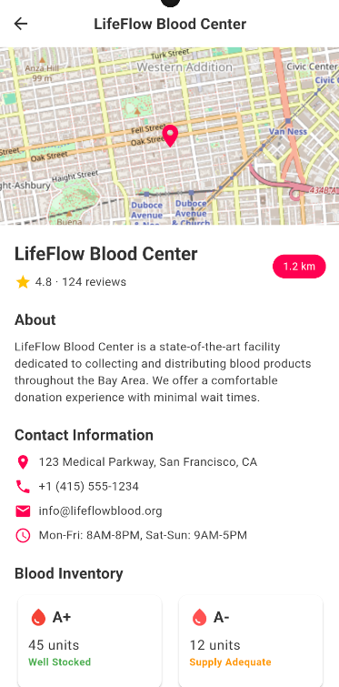

# RaktVeer

## Team Name
3beans4coffee

## Problem Statement
PS 07: BLOOD DONATION & EMERGENCY HELP

## Team Members
- Gaurav Dubey
- Ganesh Mishra
- Himanshu Mishra
- Harsh Goilkar

## Project Description
RaktVeer is a project aimed at creating a seamless connection between blood donors and recipients. The platform will facilitate easy and quick access to blood donations, ensuring that those in need can find donors efficiently.

## Installation
1. Clone the repository.
2. Run npm install in the Backend folder.
3. Create a .env file and set MONGO_URI to your MongoDB connection string.
4. Ensure Flutter SDK and Dart are installed.
5. Go to frontend/my_app directory:
   ```
   cd frontend/my_app
   ```
6. Install dependencies:
   ```
   flutter pub get
   ```

## Commands & Usage
To install dependencies and start the server, run:
```bash
cd Backend
npm install
npm run dev
```
• To run the frontend:  
  ```
  flutter run
  ```
• To build release version:  
  ```
  flutter build apk
  ```

## Preview of the Provided Solution
<table>
  <tr>
    <td align="center">
      <br/>
      <sub>User Registration screen</sub>
    </td>
    <td align="center">
      <br/>
      <sub>SOS and emergency helpline</sub>
    </td>
    <td align="center">
      <br/>
      <sub>Home screen</sub>
    </td>
  </tr>
  <tr>
    <td align="center">
      <br/>
      <sub>List of Hospitals and their blood pool</sub>
    </td>
    <td align="center">
      <br/>
      <sub>Nearby donors and banks</sub>
    </td>
    <td align="center">
      <br/>
      <sub>Find donor by blood group</sub>
    </td>
  </tr>
  <tr>
    <td align="center">
      <br/>
      <sub>Notification system</sub>
    </td>
    <td align="center">
      <br/>
      <sub>Request history</sub>
    </td>
    <td align="center">
      <br/>
      <sub>User profile</sub>
    </td>
  </tr>
</table>


